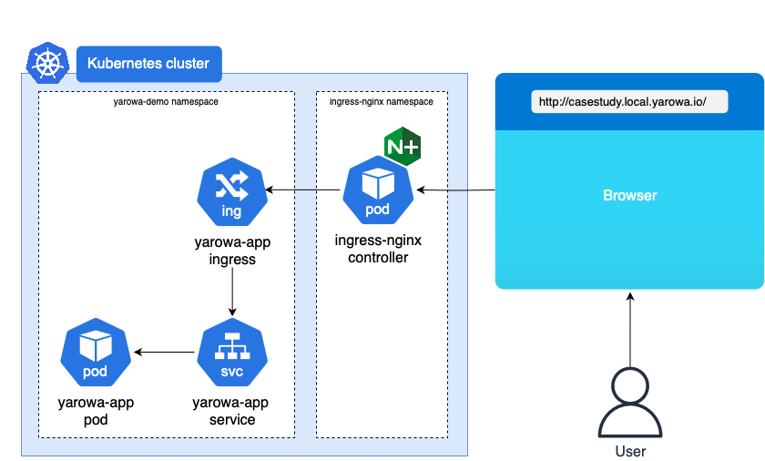

# Introduction

This repository consists of a demo FastAPI web application running in a Kubernetes cluster.

## Simplifield Project Structure

```bash
├── Dockerfile                # Dockerfile for the FastAPI web app
├── LICENSE.md                # MIT License
├── README.md                 # Instructions on how to get started
├── assets                    
├── app                       # FastAPI application code
│   ├── main.py
│   ├── requirements.txt
│   └── templates
├── build_and_deploy.sh       # Script that builds and deploys Kubernetes resources 
├── helmchart                 # Helm Chart for the Kubernetes resources
│   └── yarova-demo-app
│       ├── Chart.yaml
│       ├── templates
│       └── values.yaml
├── helmfile.d                # Helmfile deploys Helm Charts in to a Kubernetes cluster
└── USE_CASE.md               # Use case instructions
```

## High-Level Architecture



## Prerequisites

Below prerequisites are necessary to run the project locally.

>💡 **NOTE** 💡
>
> The project was developed & tested on:
> - `OS: maOS Sequoia 15.0.1`,
> - `Docker Desktop Version: 4.34.3`,
> - `Docker Engine Version: 27.2.0`,
> - `Kubernetes: v1.30.2`.
>
> 🚨 Some errors may occur when running the below steps in different environments! 🚨

1. Install [Docker Desktop](https://www.docker.com/products/docker-desktop/).

2. Install [helm](https://helm.sh/docs/intro/install/) and [helmfile](https://helmfile.readthedocs.io/en/latest/#installation) on your local machine.

- Install the following plugins:
    - plugin: diff
    - plugin: secrets
    - plugin: s3
    - plugin: helm-git

3. Enable Kubernetes in Docker Desktop application:

`Settings --> Kubernetes --> Enable Kubernetes`

>💡 [kubectl](https://kubernetes.io/docs/tasks/tools/) should work out of the box if you are using Docker Desktop

4. Install `curl` if not already instaled.

5. Install [nginx ingress controler](https://kubernetes.github.io/ingress-nginx/deploy/#quick-start) into the Kubernetes cluster:

```bash
kubectl apply -f https://raw.githubusercontent.com/kubernetes/ingress-nginx/controller-v1.12.0-beta.0/deploy/static/provider/cloud/deploy.yaml
```

6. Update `/etc/hosts` file on the local machine:

```bash
# yarowa-usecase-demo-app
127.0.0.1	casestudy.local.yarowa.io
```

7. Docker image location:

Docker image is available in the [public Docker Hub repository](https://hub.docker.com/r/hala0ner/yarowa-demo/tags).

# Getting Started

1. Clone the repository:

```bash
git clone git@github.com:halaoner/yarowa-demo.git
```

2. Make sure the steps from [Prerequisites](#prerequisites) section are implemented.

... there are two ways of deploying the Helm chart into the Kuberentes cluster ...

- **Option 1** - using `helmfile`
- **Option 2** - using `build_and_deploy.sh` script --> The script builds and pushes the Docker image to the public Docker Hub repository. Then, deploys the Helm chart into the Kubernetes cluster, and checks the connection to the pod via `curl` command
> 🚧 `build` and `push` functions are commented out by default.

## Option 1

1. Navigate to the `helmfile.d/` directory:

```
cd yarowa-demo/helmfile.d/
```

2. Deploy helmfile:

```bash
# Install required dependencies
helmfile init

# Sync your Kubernetes cluster state to the desired one 
helmfile apply
```
Expected output:

```bash
Upgrading release=yarowa-app, chart=../helmchart/yarova-demo-app, namespace=yarowa-demo
Release "yarowa-app" does not exist. Installing it now.
NAME: yarowa-app
LAST DEPLOYED: Thu Nov 14 21:57:14 2024
NAMESPACE: yarowa-demo
STATUS: deployed
REVISION: 1
TEST SUITE: None

Listing releases matching ^yarowa-app$
yarowa-app	yarowa-demo	1       	2024-11-14 21:57:14.454878 +0100 CET	deployed	yarowa-demo-app-0.1.0	1.0.0      


UPDATED RELEASES:
NAME         NAMESPACE     CHART                           VERSION   DURATION
yarowa-app   yarowa-demo   ../helmchart/yarova-demo-app/   0.1.0           0s
```

## Option 2

1. Execute the `build_and_deploy.sh` script:

```bash
./build_and_deploy.sh
```

2. Check if the Helm chart was deployed to the Kubernetes cluster and the connection to the pod on port `80` was established:

Expected output:

```bash
...
...
Waiting for the applicaton to start up...
OK: Endpoint returned HTTP 200 response status code
```


# Deployment Check

1. ✅ Check provisioned Kubernetes resources:

Check resources in `yarowa-demo` namespace:

```bash
kubectl get all -n yarowa-demo
```

Output:

```bash
NAME                                        READY   STATUS    RESTARTS   AGE
pod/yarowa-app-deployment-8b9566d7b-9v2lz   1/1     Running   0          25m

NAME                         TYPE        CLUSTER-IP     EXTERNAL-IP   PORT(S)   AGE
service/yarowa-app-service   ClusterIP   10.98.60.198   <none>        80/TCP    25m

NAME                                    READY   UP-TO-DATE   AVAILABLE   AGE
deployment.apps/yarowa-app-deployment   1/1     1            1           25m

NAME                                              DESIRED   CURRENT   READY   AGE
replicaset.apps/yarowa-app-deployment-8b9566d7b   1         1         1       25m
```

Check `ingress-nginx-controller`:

```bash
kubectl get all -n ingress-nginx
```

Output:

```bash
NAME                                            READY   STATUS      RESTARTS   AGE
pod/ingress-nginx-admission-create-xv58l        0/1     Completed   0          21h
pod/ingress-nginx-admission-patch-s6kst         0/1     Completed   0          21h
pod/ingress-nginx-controller-6568cc55cd-rq76p   1/1     Running     0          21h

NAME                                         TYPE           CLUSTER-IP       EXTERNAL-IP   PORT(S)                      AGE
service/ingress-nginx-controller             LoadBalancer   10.108.155.214   localhost     80:32470/TCP,443:30439/TCP   21h
service/ingress-nginx-controller-admission   ClusterIP      10.103.19.159    <none>        443/TCP                      21h

NAME                                       READY   UP-TO-DATE   AVAILABLE   AGE
deployment.apps/ingress-nginx-controller   1/1     1            1           21h

NAME                                                  DESIRED   CURRENT   READY   AGE
replicaset.apps/ingress-nginx-controller-6568cc55cd   1         1         1       21h

NAME                                       STATUS     COMPLETIONS   DURATION   AGE
job.batch/ingress-nginx-admission-create   Complete   1/1           3s         21h
job.batch/ingress-nginx-admission-patch    Complete   1/1           3s         21h
```

2. ✅ Send HTTP request to the application endpoint (`/`) - (via `curl` or browser at `http://casestudy.local.yarowa.io/`)

```bash
curl casestudy.local.yarowa.io 
```

Output:

```bash
# Output from curl
<!DOCTYPE html>
<html lang="en">
<head>
    <meta charset="UTF-8">
    <meta name="viewport" content="width=device-width, initial-scale=1.0">
    <title>Welcome</title>
</head>
<body>
    <h1>Hello Yarowa AG!</h1>
</body>
</html>% 
```

3. ✅ Check `ingress-nginx` controller's logs:

```bash
kubectl logs pod/ingress-nginx-controller-6568cc55cd-rq76p -f -n ingress-nginx
```

Output:

```bash
# via curl
192.168.65.3 - - [15/Nov/2024:11:09:25 +0000] "GET / HTTP/1.1" 200 229 "-" "curl/8.7.1" 88 0.022 [yarowa-demo-yarowa-app-service-80] [] 10.1.0.31:5000 229 0.022 200 8cf3f3ae24839f961b6daff3f26b99e3
# via Google Chrome browser
192.168.65.3 - - [15/Nov/2024:11:12:08 +0000] "GET / HTTP/1.1" 200 229 "-" "Mozilla/5.0 (Macintosh; Intel Mac OS X 10_15_7) AppleWebKit/537.36 (KHTML, like Gecko) Chrome/130.0.0.0 Safari/537.36" 472 0.010 [yarowa-demo-yarowa-app-service-80] [] 10.1.0.31:5000 229 0.010 200 e8a86fe0ffb1cb104bd693da5b317157
```

# ChatGPT Usage

- Improving FastAPI wep app (handling invalid endpoints) + generating `error.html` template
- Improving Helm chart `templates` - following best practices
- Improving `build_and_deploy.sh` - optimizing `STATUS_CODE`
- Generating `.gitignore` files


# Time Spent

Below table represents an approximate time spent per each domain.

| Item                              | Duration [min]         | Notes                                                     |
|-----------------------------------|:----------------------:|-----------------------------------------------------------|
| FastAPI app + troubleshooting     | 40                     |                                                           |
| Dockerfile + troubleshooting      | 40                     |                                                           |   
| Dockerfile security fixes         | 20                     | fixed vulnerabilities in version `1.0.0`                                                          |   
| Create Docker Hub account + repo  | 10                     |                                                           |
| Helm Chart                        | 60                     |                                                           |
| Deployment + troubleshooting      | 60                     |                                                           |
| Documentation                     | 30                     |                                                           |
| build & deploy script + testing   | 60                     |                                                           |
| Polishing                         | 70                     | FastAPI, script, charts, documentation, `.gitignore`      |
| TOTAL                             | 390                    | 6.5 hours                                                 |